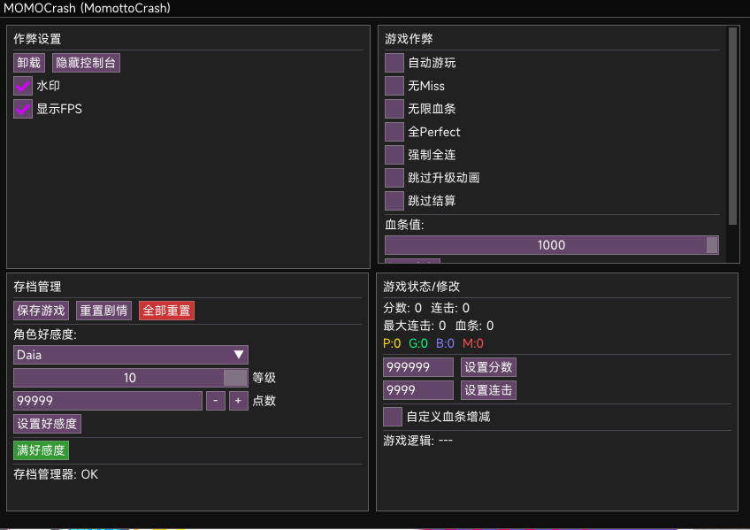
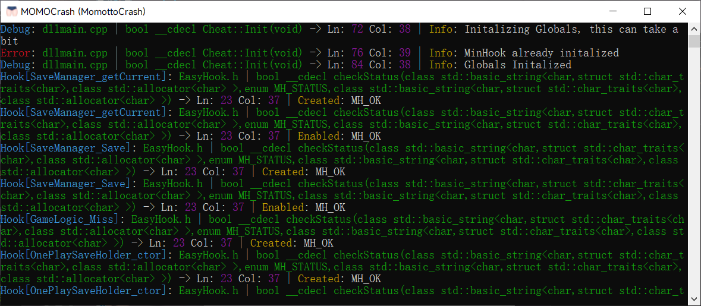

# MOMOCrash-Cheat

Steam 版 MOMOCrash（MomottoCrash）的修改器

[English](README.md)

## 快捷键
- `Insert` - 显示/隐藏菜单
- `End` - 卸载修改器

## 注意事项
如果菜单不显示，请以窗口模式运行游戏，并在注入前将窗口放大！

## 注入教程
https://youtu.be/4X9lxytX4ek?si=xJ7Ouy6d0HJwZwMR

## 依赖
- [Microsoft Visual C++ Redistributable x64](https://aka.ms/vs/17/release/vc_redist.x64.exe)
- [DirectX End-User Runtimes (June 2010)](http://www.microsoft.com/en-us/download/confirmation.aspx?id=8109)
- [Mono](https://www.mono-project.com/download/stable/)（仅编译需要）

## 截图

## 功能

### 游戏作弊
- 自动游玩
- 无 Miss
- 全 Perfect
- 无限血条
- 强制全连
- 跳过升级动画
- 跳过结算
- 血条值设置

### 存档管理
- 保存游戏
- 重置剧情
- 全部重置
- 角色好感度修改（Daia / Hikaru / Seika）
- 满好感度一键设置

### 游戏状态/修改
- 实时显示分数、连击、最大连击、血条
- 判定统计（Perfect / Good / Bad / Miss）
- 设置分数
- 设置连击
- 自定义血条增减值（Perfect / Good / Bad）
